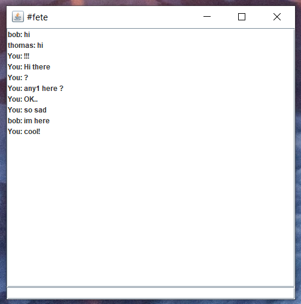

# Projet social

Thomas Saudemont / Yann Roubeau / Lucas Guffroy

## Sujet

Application de chat avec des salons publics et des discussions privées.

Une fois connecté, l'utilisateur arrive sur un écran d'accueil qui recense les utilisateurs connectés, les différentes conversations eues dans le passé avec d'autres utilisateurs, et les topics suivis. L'utilisateur peut engager une discussion avec un autre utilisateur s'il est connecté, s'il a déjà eu une conversation avec lui, ou via un topic (conversation de groupe). L'utilisateur peut également s'inscrire ou se désinscrire d'un topic. 

## Ecrans

### Ecran de connexion

### Ecran d'accueil

### Ecran de conversation

## Rapport

https://docs.google.com/presentation/d/1Mbl3cYsfXNBd475IFyae746w0vCzz4pNIyQXhmJseMc/edit#slide=id.g35f391192_00